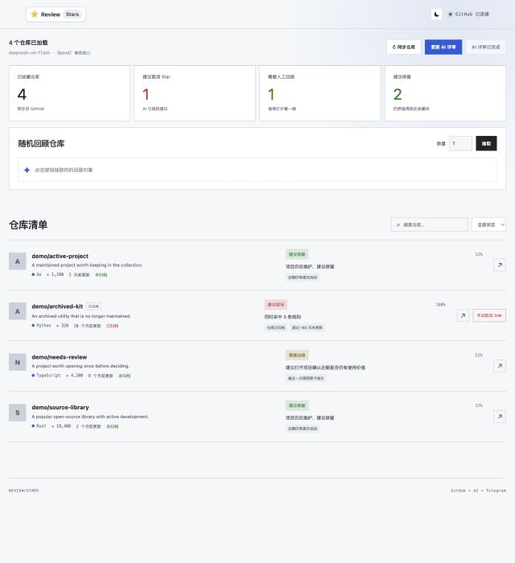

# Review Stars

<p align="center">
  
</p>

Review Stars turns a GitHub Stars collection into an actionable list. It syncs starred repositories, asks an OpenAI-compatible AI API which stars may no longer be worth keeping, records the reasons, and sends scheduled random repository reminders through Telegram.

The frontend uses Vue 3 + Vite and the backend uses Go. Production builds embed `web/dist` into the Go binary, so deployment only needs one executable. Repository metadata and review results are stored in SQLite.

[简体中文](README.zh-CN.md)

Licensed under the [GNU Affero General Public License v3.0](LICENSE).

## Screenshot

<p align="center">
  
</p>

The screenshot uses illustrative repository data.

## Quick start

Requirements: Go 1.22+, Node.js 20+, and npm.

```bash
cp .env.example .env
# Edit .env and set at least GITHUB_TOKEN and AI_API_KEY

cd web
npm install
npm run build
cd ..

go run .
```

The application loads `.env` from the project root. An already-exported shell variable has priority over the file.

Open <http://localhost:8080>.

Startup only loads data from SQLite; it does not sync GitHub automatically. Click **Sync repositories** for the first sync or whenever the Stars list needs refreshing. The sync loads all Stars and reuses reviews whose repository metadata has not changed.

Build a single executable with:

```bash
make build
./review-stars
```

## Configuration

- `GITHUB_TOKEN`: GitHub fine-grained PAT. It needs `Starring: read`; the page's **Unstar** action also needs `Starring: read and write`.
- `AI_API_KEY`: API key for the configured OpenAI-compatible provider.
- `AI_BASE_URL`: provider base URL. `/chat/completions` is appended automatically. The DeepSeek example is `https://api.deepseek.com`.
- `AI_MODEL`: model name supported by that provider, for example `deepseek-v4-flash`.
- `AI_THINKING`: DeepSeek thinking mode, `disabled` by default; set to `enabled` for harder reviews.
- `AI_MAX_TOKENS`: maximum generated tokens per AI batch response, default `16000`.
- `APP_LANGUAGE`: page and review language, `zh-CN` by default or `en`.
- `TELEGRAM_BOT_TOKEN` and `TELEGRAM_CHAT_ID`: enable scheduled Telegram reminders when both are set.
- `DATABASE_FILE`: SQLite path, default `review-stars.db`.
- `REVIEW_BATCH_SIZE`: repositories per AI request, default 50. All Stars are loaded and reviewed in batches.
- `REVIEW_CRON`: optional 5-field cron expression or `@every 24h`. It selects random repositories from SQLite for Telegram reminders; it does not sync GitHub.
- `REVIEW_COUNT`: repositories sent per scheduled run, default 1.
- `RULE_STATUSES`: pre-AI status filter, comma-separated, default `archived`; for example `archived,disabled`.
- `RULE_STALE_DAYS`: days without an update before the pre-AI stale filter matches, default 180; set to `0` to disable.
- `RULE_MAX_STARS`: Star threshold for the pre-AI low-Star filter, default 1000; set to `0` to disable.
- `HOST`: listen address, default `127.0.0.1`.
- `PORT`: HTTP port, default `8080`.

`REVIEW_MAX_REPOS` is no longer used. The sync and review scope is all Stars; `REVIEW_BATCH_SIZE` only controls request size, while `REVIEW_COUNT` controls Telegram reminders.

The old `OPENROUTER_*` and `APP_URL` settings are no longer read. Replace them with `AI_API_KEY`, `AI_BASE_URL`, and `AI_MODEL`.

## Telegram setup

1. Contact `@BotFather` in Telegram, run `/newbot`, and copy the `TELEGRAM_BOT_TOKEN`.
2. Send the bot a message directly. A group is not required.
3. Open `https://api.telegram.org/bot<TOKEN>/getUpdates` and find `message.chat.id` in the response.
4. Put that value in `TELEGRAM_CHAT_ID` and restart the application.

Telegram is used only by the backend cron job. There is no manual Telegram button in the web page.

The page follows the operating system light/dark preference by default. Use the sun/moon button to choose a mode; the choice is stored in the browser.

## API

```text
GET    /api/health
GET    /api/stars             # read synced repositories from SQLite
POST   /api/sync              # sync all Stars from GitHub
GET    /api/review
POST   /api/review             # batch AI review; skips existing results by default; ?force=1 explicitly reviews all
GET    /api/random
DELETE /api/stars/:owner/:repo
```

## External request logs

GitHub, AI, and Telegram calls log the request, status code, duration, response size, and the complete response body. AI review runs also log accumulated prompt, completion, total, and prompt-cache-hit token counts.

```text
[github] response method=GET url=https://api.github.com/user/starred?... status=200 duration=320ms bytes=...
[ai] response method=POST url=https://api.deepseek.com/chat/completions status=200 duration=8.4s bytes=...
[telegram] response method=POST url=https://api.telegram.org/bot-REDACTED/sendMessage status=200 duration=210ms bytes=...
```

Authorization headers are never logged, and Telegram bot tokens are redacted. GitHub and AI response previews may contain repository or prompt data; restrict logs as appropriate for production.

## Review behavior

Manual sync stores all GitHub Stars, repository metadata, and the AI review cache in SQLite. The final list combines current rule matches with cached AI results. The fingerprint uses the review-relevant fields (the first 200 description characters, language, first 10 topics, archived/disabled/fork state, and pushed month); changes to Star, fork, issue, updated, or starred timestamps do not invalidate an AI review. Before each AI run, all enabled deterministic rules must match; matching repositories are immediately marked as suggested to unstar, and only the remaining repositories enter AI. AI review reuses results when the fingerprint is unchanged and requests only new or changed repositories in batches. The main AI review action also reuses unchanged results; `?force=1` is reserved for explicit API callers that really need a full rerun. **Continue AI review** skips existing AI results.

AI requests only include decision-relevant metadata: descriptions are capped at 200 characters, topics at 10 entries, and repository URL/fork/open-issue counts are omitted. Responses contain at most two concise reasons and no unused `next_action` field.

Rules run before AI and are not an AI fallback. Enabled rule groups must all match simultaneously: by default a repository must be archived, stale for 180 days, and have fewer than 1,000 Stars. Statuses inside `RULE_STATUSES` are alternatives. If any repository remains after filtering and AI is unavailable, the unified review returns an error.

The random recall panel accepts a count and returns that many repositories when available. For an archived repository, the page opens the current user's GitHub Stars search instead of calling the unstar API; remove that Star manually there. Active repositories still use the GitHub API and require the write permission.

Changing `APP_LANGUAGE` invalidates the currently loaded review language; run the unified review again. Old review payloads are not migrated.

The old `.review-cache.json` file is no longer read. Use the SQLite database created by the current application.

This is a single-user/local MVP without an additional login layer. Do not expose it directly to the public internet; add OAuth, sessions, and authorization first for multi-user deployments.

## Design choices

Rules are deterministic local checks that run before AI and do not call AI. Matching repositories are included in the same final review list; only non-matching repositories use the configured OpenAI-compatible Chat Completions endpoint.
